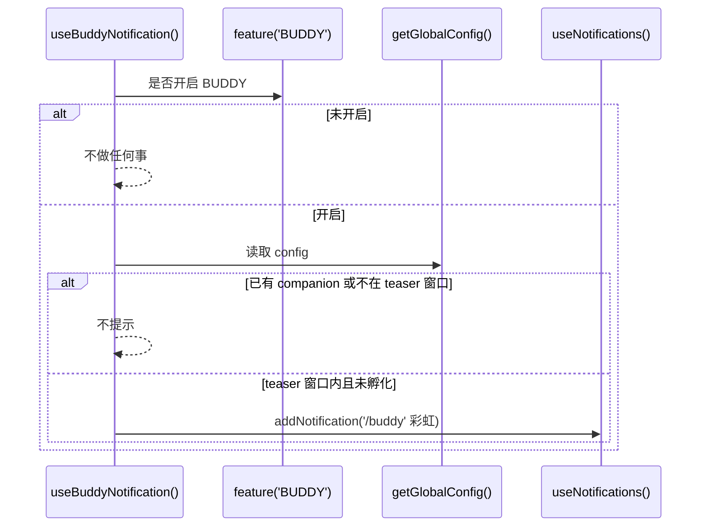
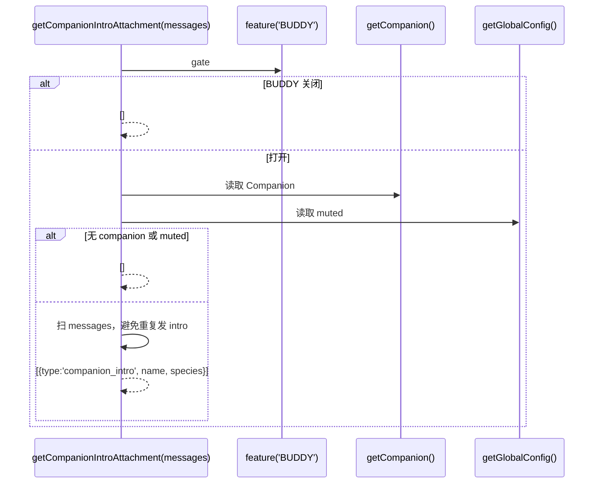

# Buddy / Companion 架构图（restored-src/src/buddy）

> 目标：把 `restored-src/src/buddy` 的实现抽象为模块关系与数据流，便于后续讨论与改造。

## 总览（组件与依赖）

```mermaid
flowchart LR
  %% Feature gate
  Feature[feature('BUDDY')<br/>bun:bundle]:::gate

  %% Config + identity
  GC[getGlobalConfig()]:::sys
  CFG[(Global Config)]:::store
  UID[companionUserId()]:::logic

  %% Deterministic roll + merge
  Roll[roll(userId)<br/>mulberry32 + hashString<br/>rollCache]:::logic
  Bones[CompanionBones<br/>(rarity/species/eye/hat/shiny/stats)]:::model
  Soul[StoredCompanion<br/>(name/personality/hatchedAt)]:::model
  Companion[getCompanion(): Companion<br/>Soul + Bones]:::model

  %% Sprites
  Sprites[sprites.ts<br/>BODIES/HAT_LINES<br/>renderSprite/renderFace]:::ui

  %% UI + state
  AppState[AppState<br/>companionReaction/companionPetAt/selection]:::store
  SpriteUI[CompanionSprite<br/>500ms tick + idle/fidget<br/>narrow/fullscreen 分支]:::ui
  FloatUI[CompanionFloatingBubble<br/>(fullscreen overlay)]:::ui

  %% Prompt integration
  PromptIntro[prompt.ts<br/>companionIntroText()]:::logic
  IntroAtt[getCompanionIntroAttachment()]:::logic
  Msgs[messages[]]:::sys
  Atts[attachments[]<br/>type=companion_intro]:::model

  %% Notifications
  NotifHook[useBuddyNotification<br/>teaser 2026-04-01..07]:::ui
  NotifCtx[useNotifications()]:::sys

  %% Wiring
  Feature --> SpriteUI
  Feature --> FloatUI
  Feature --> IntroAtt
  Feature --> NotifHook

  GC --> CFG
  UID --> GC
  Roll --> UID
  Roll --> Bones
  Soul --> GC
  Companion --> Roll
  Companion --> GC
  Companion --> SpriteUI
  Companion --> IntroAtt

  SpriteUI --> AppState
  SpriteUI --> Sprites
  FloatUI --> AppState
  FloatUI --> Sprites

  Msgs --> IntroAtt
  IntroAtt --> Atts
  PromptIntro --> Atts

  NotifHook --> NotifCtx
  NotifHook --> GC

  classDef gate fill:#fff3cd,stroke:#d39e00,color:#111;
  classDef store fill:#e8f0fe,stroke:#1a73e8,color:#111;
  classDef model fill:#e6ffed,stroke:#2da44e,color:#111;
  classDef logic fill:#f3e8ff,stroke:#7c3aed,color:#111;
  classDef ui fill:#ffe8e8,stroke:#e11d48,color:#111;
  classDef sys fill:#f1f5f9,stroke:#64748b,color:#111;
```

## 数据模型（“骨骼 + 灵魂”）

- **Bones（确定性，不落盘）**：由 `roll(userId)` 生成（`userId + SALT('friend-2026-401')` → `hashString` → `mulberry32`），包含 `rarity/species/eye/hat/shiny/stats`。
- **Soul（持久化，落盘）**：`global config` 里存 `name/personality/hatchedAt`（`StoredCompanion`）。
- **合并策略**：`getCompanion()` 每次读取时 **重新生成 Bones** 并与 Soul 合并，避免：
  - 物种改名 / `SPECIES` 变更导致旧配置不可读
  - 用户编辑配置伪造稀有度（rarity 不存储）

## 关键运行流

### 1) 启动时 / teaser 通知（/buddy）



### 2) Prompt 注入 companion 介绍（attachment）



### 3) UI 渲染：精灵动画 + 气泡 + 宽度预留

- `CompanionSprite`：
  - 以 `TICK_MS=500` 驱动 idle/fidget/blink 动画。
  - 读 `AppState.companionReaction` 控制气泡显示（约 10s，后 3s 渐隐）。
  - 读 `AppState.companionPetAt` 控制 `/buddy pet` 心心粒子（约 2.5s）。
  - **窄终端**（<100 cols）：退化成 `renderFace()` + 名字/短 quip 一行。
  - **非 fullscreen**：气泡 inline（输入区需要预留宽度）。
  - **fullscreen**：气泡通过 `CompanionFloatingBubble` 渲染为浮层（避免被布局裁剪）。
- `companionReservedColumns()`：
  - 在 BUDDY 开启且 companion 存在、未 muted、终端够宽时，返回要从输入区扣掉的列宽（sprite 列宽 + padding + 非 fullscreen 下的 bubble 宽度）。

## 代码落点（按职责）

- Roll/合并：`restored-src/src/buddy/companion.ts`
- 类型/常量：`restored-src/src/buddy/types.ts`
- ASCII 渲染：`restored-src/src/buddy/sprites.ts`
- Prompt 附件：`restored-src/src/buddy/prompt.ts`
- 精灵组件：`restored-src/src/buddy/CompanionSprite.tsx`
- 启动通知：`restored-src/src/buddy/useBuddyNotification.tsx`

