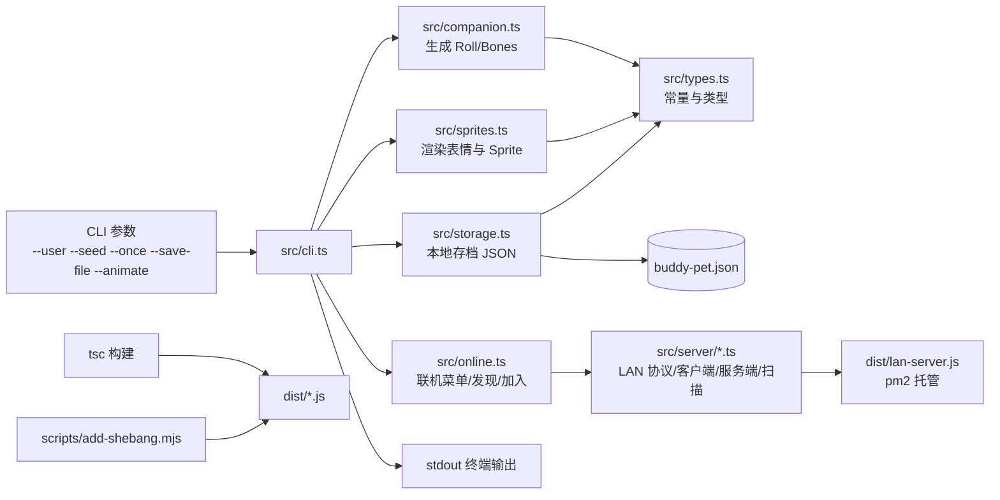

# Code Buddy 架构设计文档

## 1. 文档目的

本文档描述 `code-buddy` 项目的当前实现架构、模块边界、核心数据流、构建发布方式，以及后续可演进方向。  
该项目本质上是一个**基于 TypeScript/Node.js 的单进程 CLI 工具**，用于根据用户标识或种子生成一只具有固定属性和 ASCII 精灵形态的“Buddy”，并在终端中展示静态或简单动画效果。

## 2. 项目定位

### 2.1 目标

- 提供一个可直接通过命令行调用的宠物/伙伴生成器
- 支持按 `userId` 或 `seed` 进行**确定性生成**
- 支持展示文本化属性、表情和 ASCII Sprite
- 支持简单的逐帧终端动画
- 同时作为 CLI 工具和可复用的 TypeScript 库发布

### 2.2 非目标

- 核心离线玩法不依赖网络；联机能力仅面向局域网（LAN）
- 不涉及数据库、互联网服务端存储
- 不提供图形界面，仅面向终端输出
- 不做复杂命令解析、插件机制或服务端状态持久化（但支持本地 JSON 存档）

## 3. 总体架构

项目采用非常轻量的分层结构，可概括为：

1. **CLI 入口层**：处理命令行参数、控制输出和动画生命周期
2. **领域生成层**：基于确定性随机算法生成 Buddy 属性
3. **渲染层**：将 Buddy 属性映射为 ASCII 表情和 Sprite 帧
4. **本地存档层**：将 Buddy 结果以 JSON 形式保存 / 读取 / 删除
5. **类型与常量层**：统一维护物种、稀有度、眼睛、帽子、属性等枚举和类型
6. **构建发布层**：将 TypeScript 编译为 `dist`，补充 shebang 后作为 npm CLI 包发布
7. **局域网联机层（可选）**：提供可独立部署的 LAN 服务器（房间 / 用户列表），以及 CLI 侧的发现与加入流程

可用下图理解主链路：



## 4. 目录与模块职责

### 4.1 源码目录

#### `src/cli.ts`

CLI 主入口，职责包括：

- 解析命令行参数：`--user`、`--seed`、`--once`、`--save-file`、`--list-species`、`--list-eyes`、`--list-hats`、`--animate`
- 默认进入交互式菜单模式（当未传入 `--user` / `--seed` / `--once` 时）
- 调用 `roll` / `rollWithSeed` / `rollRandom` 生成 Buddy
- 调用 `renderFace` / `renderSprite` 输出文本与 ASCII 图像
- 在 `--animate` 场景下通过循环 + `sleep` 驱动动画，并用 ANSI 光标控制覆盖上一帧
- 通过 `storage` 模块进行本地存档的加载 / 保存 / 删除

该模块是**编排层**，不直接承载复杂业务规则，主要负责串联其它纯函数模块。

#### `src/companion.ts`

Buddy 生成核心模块，职责包括：

- 提供种子随机数生成器 `mulberry32`
- 将字符串稳定映射为数值种子 `hashString`
- 按权重抽取稀有度 `rollRarity`
- 根据稀有度和规则生成数值属性 `rollStats`
- 组装完整 `CompanionBones`
- 对 `userId` 生成路径提供单项缓存 `rollCache`
- 提供非确定性的随机抽取 `rollRandom`（基于时间戳与 `randomUUID()` 组合作为种子）

这是项目的**领域核心模块**，决定“同一个输入生成同一个 Buddy”的确定性行为。

#### `src/sprites.ts`

ASCII 渲染模块，职责包括：

- 维护每个物种的多帧 Sprite 模板 `BODIES`
- 维护帽子覆盖层 `HAT_LINES`
- 用眼睛字符替换模板中的 `{E}`
- 根据当前物种返回总帧数 `spriteFrameCount`
- 生成简化表情串 `renderFace`

这是项目的**表现层核心模块**，将领域数据映射为终端可见结果。

#### `src/types.ts`

统一的类型和运行时常量定义，职责包括：

- 定义 `Rarity`、`Species`、`Eye`、`Hat`、`StatName`、`CompanionBones`
- 定义 `RARITY_WEIGHTS`、`RARITY_SCORES`、`RARITY_LABELS`、`RARITY_BADGES`、`RARITY_ANSI_COLORS`、`STAT_NAMES`
- 定义 `SPECIES`、`EYES`、`HATS`
- 通过 `String.fromCharCode` 运行时构造物种字符串

该模块是项目的**单一事实来源**，其它模块都依赖它。

#### `src/index.ts`

库入口文件，统一 re-export：

- 类型定义
- 随机生成 API
- 渲染 API

该模块让项目除 CLI 外，还能作为一个可导入的 npm 库被外部代码复用。

#### `src/storage.ts`

本地存档模块，职责包括：

- 将 `Roll` 以 JSON 形式写入本地文件（默认 `./buddy-pet.json`）
- 从本地文件读取并解析存档
- 删除本地存档文件
- 对历史存档结构做兼容归一化（例如 `rarityScore` / `level` 字段）

#### `src/online.ts`

联机入口（CLI 侧），职责包括：

- 在交互式 CLI 中提供“联机服务”菜单入口
- 扫描局域网 IP（默认 `/24`）以发现同协议的 Buddy LAN 服务器
- 作为客户端加入指定服务器，并提供基础的房间/用户列表操作
- 支持在本地同进程临时开启一个 LAN 服务器（便于开发与演示）

#### `src/lan-server.ts`

LAN 服务器进程入口（可由 pm2 托管），职责包括：

- 启动 `createBuddyLanServer()` 并监听 `4432`
- 支持通过命令行参数或环境变量配置 `HOST` / `PORT` / `NAME`
- 处理 `SIGINT` / `SIGTERM` 做优雅退出

#### `src/server/*.ts`

局域网联机模块（可复用的通用服务端/客户端实现），职责包括：

- `protocol.ts`：消息协议与数据结构（NDJSON over TCP）
- `ndjson.ts`：NDJSON 编解码（按行 JSON）
- `rooms.ts`：房间注册表（创建/加入/离开、空房间回收）
- `server.ts`：LAN 服务器实现（用户列表、房间广播、请求响应）
- `client.ts`：LAN 客户端实现（请求/响应、状态更新）
- `discovery.ts`：局域网扫描发现（对 `4432` 端口进行并发探测）

### 4.2 构建脚本

#### `scripts/add-shebang.mjs`

在构建完成后读取 `dist/cli.js`，若缺少 shebang，则补充：

```sh
#!/usr/bin/env node
```

这样 npm 安装后的 `buddy` 命令可以直接在终端执行。

## 5. 核心数据模型

项目围绕 `CompanionBones` 展开，结构如下：

```ts
type CompanionBones = {
  rarity: Rarity
  rarityScore: number
  species: Species
  eye: Eye
  hat: Hat
  shiny: boolean
  stats: Record<StatName, number>
}
```

字段含义：

- `rarity`：稀有度，决定徽章/颜色展示，也影响属性下限
- `rarityScore`：稀有度分数（用于展示与存档兼容）
- `species`：物种，决定使用哪一组 Sprite 模板
- `eye`：眼睛字符，参与表情和 Sprite 替换
- `hat`：帽子装饰，叠加到 Sprite 首行
- `shiny`：闪光标记，当前仅用于文本展示
- `stats`：数值属性，用于性格/能力表达

`Roll` 结构在 `CompanionBones` 之外补充：

- `bones`：生成出的 Buddy 主体
- `inspirationSeed`：额外输出的随机灵感种子，便于展示和二次传播

## 6. 核心运行流程

### 6.1 交互式菜单流程（默认行为）

当未传入 `--user` / `--seed` / `--once` 时，CLI 会：

1. 尝试从 `--save-file`（默认 `./buddy-pet.json`）加载本地存档
2. 展示交互式菜单（查看已保存、连续抽取、单次抽取、播放动画、删除存档、帮助等）
3. 在“抽取”流程中调用 `rollRandom()` 生成候选 Buddy，并按用户选择决定是否写入存档

### 6.2 单次展示流程（带参数运行）

```text
命令行输入
  -> 参数解析
  -> 确定输入源（user / seed / 当前时间）
  -> 调用 companion 生成 bones
  -> 输出基础属性和 stats
  -> 调用 sprites 渲染表情与首帧 sprite
  -> 打印到终端
```

补充说明：

- `--user <id>`：调用 `roll(userId)`（确定性）
- `--seed <seed>`：调用 `rollWithSeed(seed)`（确定性）
- `--once`：调用 `rollRandom()`（非确定性；输出后会询问是否保存）

### 6.3 动画流程

当用户传入 `--animate` 时：

1. 使用 `spriteFrameCount(species)` 获取当前物种总帧数
2. 每帧调用 `renderSprite(bones, frame)` 得到当前帧
3. 通过 ANSI 光标控制逐行回退并清除上一帧内容
4. `sleep(400ms)` 后渲染下一帧
5. 默认播放固定轮数后结束（无需常驻定时器）

### 6.4 确定性生成流程

1. 输入字符串（`userId + SALT` 或 `seed`）
2. `hashString` 将字符串转换为 32 位整数
3. `mulberry32` 基于该整数生成伪随机序列
4. 用相同 RNG 顺序依次决定：
   - 稀有度
   - 物种
   - 眼睛
   - 帽子
   - 是否 shiny
   - 各项 stats
   - inspirationSeed

因此，只要输入相同，生成结果就稳定一致。

### 6.5 局域网联机流程（可选）

联机基于 **TCP + NDJSON（按行 JSON）** 的轻量协议，默认端口为 `4432`：

1. **发现**：客户端向局域网广播 UDP `probe`（默认端口 `4432`），服务端以 UDP `probe_result` 响应（包含服务器名、在线人数、房间数）；若广播受限则回退为 TCP 扫描同网段 `/24` 探测
2. **加入**：客户端连接目标服务器并发送 `hello`，服务端返回 `welcome`（包含当前用户列表与房间列表）
3. **房间**：客户端可 `create_room` / `join_room` / `leave_room`；服务端会广播 `users_update` / `rooms_update` 给所有连接

## 7. 设计特点与关键约束

### 7.1 纯函数优先

除了 CLI 输出、动画定时器和一个轻量缓存外，核心逻辑基本由纯函数组成：

- `rollWithSeed`
- `renderSprite`
- `renderFace`
- `spriteFrameCount`

优点是：

- 容易测试
- 容易复用
- 逻辑边界清晰

### 7.2 数据驱动渲染

物种 Sprite 通过 `BODIES` 常量集中配置，新增物种时通常只需：

1. 在 `types.ts` 增加物种常量和 `SPECIES`
2. 在 `sprites.ts` 增加对应帧模板
3. 在 `renderFace` 中补充该物种表情逻辑

这使得渲染层具有较好的可扩展性。

### 7.3 稀有度驱动属性分布

`rollStats` 中通过 `RARITY_FLOOR` 控制不同稀有度的数值底线，并额外生成：

- 一个高峰属性 `peak`
- 一个低谷属性 `dump`

这让生成结果更有个体差异，而不是平均分布。

### 7.4 CLI 与库双入口

项目既有：

- `bin.buddy -> dist/cli.js` 供命令行执行
- `exports["."] -> dist/index.js` 供外部代码导入

因此从架构上看，它已经具备“**同一套领域能力，多种接入方式**”的基础。

## 8. 构建与发布架构

### 8.1 编译链路

构建脚本：

```json
"build": "tsc -p tsconfig.json && node ./scripts/add-shebang.mjs"
```

处理流程：

1. TypeScript 依据 `tsconfig.json` 编译 `src/**/*.ts`
2. 产物输出到 `dist/`
3. 生成 `.d.ts` 声明文件和 source map
4. 后置脚本补充 CLI shebang

### 8.2 发布链路

- `prepack` 会自动触发 `npm run build`
- `files` 仅发布 `dist`
- `main`、`types`、`exports`、`bin` 都指向 `dist` 中的编译结果

这意味着源码不直接发布到包内，发布产物是清晰且可控的。

## 9. 当前架构优点

- **极简**：模块少，依赖少，学习成本低
- **确定性强**：同输入同输出，适合分享和复现
- **可复用**：CLI 与库 API 已分离
- **扩展成本低**：新增物种、帽子、眼睛、稀有度都比较直接
- **构建清晰**：纯 TypeScript 编译，无复杂打包链

## 10. 当前架构局限

### 10.1 命令解析较原始

目前采用手写 `switch` 解析参数，适合当前体量，但在新增命令、子命令、错误提示和参数校验时会变得分散。

### 10.2 领域数据与显示资源强耦合

物种定义、渲染模板、表情规则分别散落在 `types.ts` 和 `sprites.ts` 中。  
当物种规模扩大时，维护会逐渐从“简单”变成“同步修改多个位置”。

### 10.3 动画输出依赖终端能力

动画通过 ANSI 控制符实现，依赖终端支持光标移动和清屏；在某些编码或终端环境下，字符显示可能出现兼容性问题。

### 10.4 缓存策略较轻

`roll(userId)` 只缓存最近一次结果，适合热点重复调用，但不适合更复杂的批量生成或长期缓存场景。

### 10.5 缺少自动化测试

当前项目未看到测试目录或测试脚本，意味着：

- 确定性生成逻辑缺少回归保护
- Sprite 模板改动缺少快照保障
- CLI 参数行为缺少自动验证

## 11. 推荐演进方向

以下建议分为“保持轻量前提下的优化”，并非当前必须立即实施。

### 11.1 引入注册表式物种定义

可将每个物种的以下内容合并为单条配置：

- `species`
- `frames`
- `faceRenderer`
- 可选默认装饰规则

收益：

- 消除 `types.ts` 与 `sprites.ts` 间的分散维护
- 新增物种时更接近“插入配置”
- 便于未来将物种资源外置为 JSON 或独立模块

### 11.2 抽离 CLI 应用层

可把 `src/cli.ts` 再拆分为：

- `application/generateBuddy.ts`
- `presentation/terminal.ts`
- `cli.ts`

收益：

- 更容易测试
- 更容易支持其它前端，如 Web 或聊天机器人接入

### 11.3 为确定性逻辑补充测试

建议优先增加三类测试：

- 固定 seed 的生成快照测试
- `renderSprite` / `renderFace` 的渲染测试
- CLI 参数行为测试

### 11.4 规范化字符与资源编码

建议统一以 UTF-8 保存源码与终端输出文案，并校验眼睛字符、星级字符和帮助文案在不同平台的显示效果。

## 12. 总结

`code-buddy` 当前架构非常适合其产品目标：  
它不是一个复杂系统，而是一个**以确定性生成和 ASCII 表现为核心的轻量 CLI/库双用项目**。

从设计上看，它最重要的优点不是“层次很多”，而是：

- 领域逻辑简单且稳定
- 渲染规则集中且直观
- 构建发布路径短
- 后续可沿着“数据驱动”和“多接入层复用”继续扩展

如果未来项目继续增长，最值得优先投入的方向是：

1. 补测试
2. 合并物种定义与渲染配置
3. 拆分 CLI 编排与应用服务层

在当前规模下，这套架构已经是**实现成本低、可读性高、扩展路径清晰**的方案。
